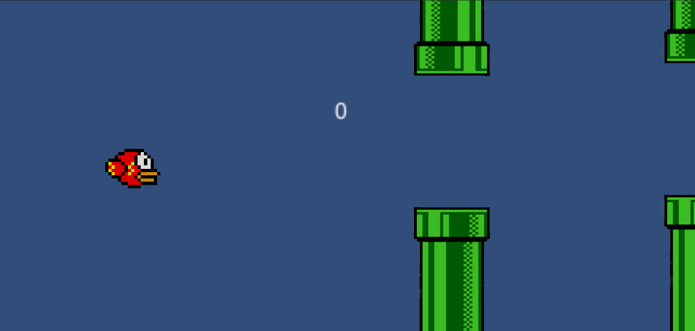
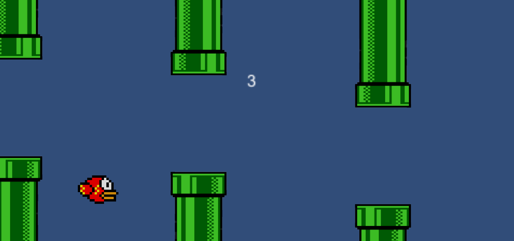

# Flappy Bird Game (Unity / C#)

Dec 4, 2021 | Created when I was in 11th grade, this is a simple (my first) Flappy Bird style game made in Unity to practice basic game looping logic, collision handling, scoring systems, and a simple UI.

---

## Preview (Screenshots)

| Start Screen | Points / Score |
|---|---|
|  |  |

---

## Features

- Flappy Bird-style gameplay (tap/press to fly)
- Obstacle spawning (pipes)
- Collision detection (game over)
- Score / points system
- Simple start UI

---

## Tech Stack

- **Engine:** Unity  
- **Language:** C#  
- **IDE:** Visual Studio (recommended)  
- **Project Type:** Unity project (Assets/Packages/ProjectSettings structure)  

---

## Project Structure (High Level)

- `Assets/` - Game assets & scripts (gameplay logic, UI, prefabs, sprites, etc.)
- `Packages/` - Unity package dependencies
- `ProjectSettings/` - Unity project configuration
- `UserSettings/` - Local editor/user settings
- `docs/` - Screenshots for README

---

## Getting Started

### Requirements
- Unity Hub + Unity Editor (recommended: version compatible with this project)
- Visual Studio (or another C# IDE)

### Run Locally
1. Clone the repository:
   ```bash
   git clone https://github.com/Aryosetowmn/gamedev_kelas11semester1_port7.git
   ```
2. Open **Unity Hub**
3. Click **Open** → select the project folder
4. Wait for Unity to import assets/packages
5. Press **Play** in the Unity Editor

---

## Notes

This repository is intended for learning and portfolio demonstration.  
For a more advanced version, you could add sound effects, different difficulty levels, and better UI/menus.

---

## Author

**Aryosetowmn**  
Repository: `Aryosetowmn/gamedev_kelas11semester1_port7`
